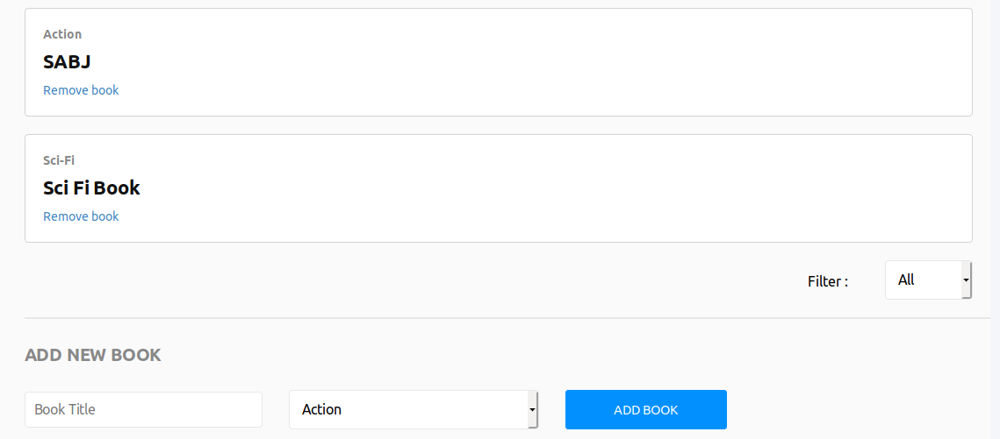

## Bookstore app
- The project is a simple bookstore app that helps users organize and manage the books they read.
- It was built using react and redux which uses an [API](https://bookstore-backends.herokuapp.com/books) to store the books built using ruby on rails which can be found [here](https://github.com/fatymahmed/bookstore-backend).

[Live link](https://bookstore-react-app.herokuapp.com)

## Authors
- Fatima Ahmed [http://github.com/fatymahmed]
- Kingsley Uche [https://github.com/Urchmaney]  

This project was bootstrapped with [Create React App](https://github.com/facebook/create-react-app).

## Installation

### Clone the project
- git clone git@github.com:fatymahmed/bookstore-react.git

### Install dependencies
- `npm install`

### Run the app
 - `npm start`

Runs the app in the development mode. 
Open [http://localhost:3000](http://localhost:3000) to view it in the browser.

