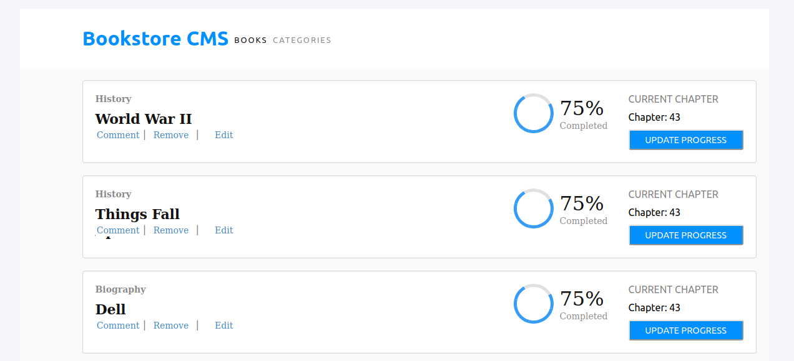

## Bookstore app
- The project is A Bookstore CMS that allows users to add books to a library and filter them according to the category.
- It was built using react and redux which uses a Rails [API](https://bookstore-backends.herokuapp.com/books) to store the books, API repository can be found [here](https://github.com/fatymahmed/bookstore-backend).

[Live link](https://bookstore-react-app.herokuapp.com)

This project was bootstrapped with [Create React App](https://github.com/facebook/create-react-app).

## Installation

### Clone the project
- git clone git@github.com:fatymahmed/bookstore-react.git

### Install dependencies
- `npm install`

### Run the app
 - `npm start`

Run the app in the development mode. 
Open [http://localhost:3000](http://localhost:3000) to view it on the browser.

## Authors

👤 **Fatima Ahmed**

- Github: [@githubhandle](https://github.com/fatymahmed)
- Twitter: [@twitterhandle](https://twitter.com/fatymahmed)
- Linkedin: [linkedin](https://www.linkedin.com/in/fatimahmed/)

👤 **Kingsley Uche**

- Github: [@githubhandle](https://github.com/Urchmaney)
- Linkedin: [linkedin](https://www.linkedin.com/in/kingsley-uche/)
